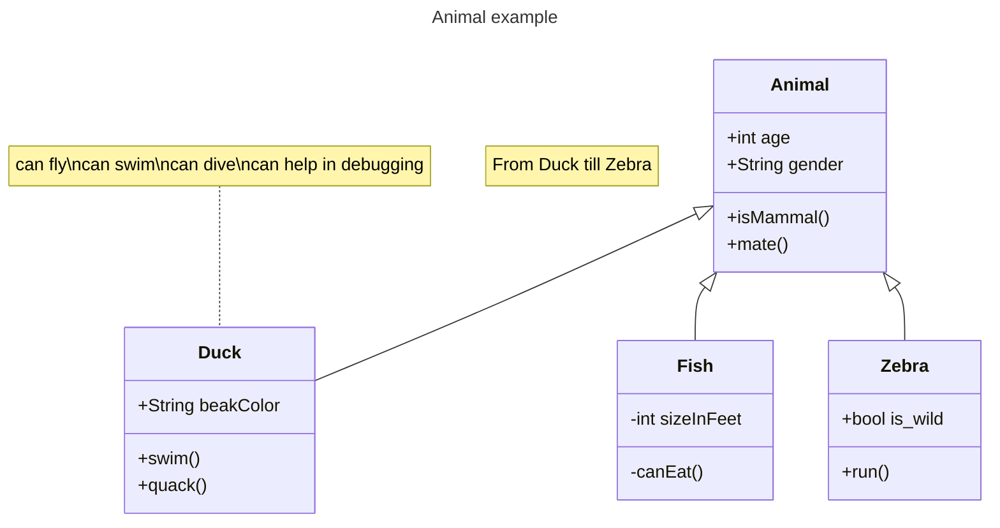

# TowerDefenseTemplate
Dit is een template wat door jullie te gebruiken is voor het juist inleveren van alle producten voor de Towerdefense beroepsopdracht. **Verwijder uiteindelijk de template teksten!**

Begin met een korte omschrijving van je towerdefense game en hoe deze werkt. Plaats ook een paar screenshots.

## Product 1: "DRY SRP Scripts op GitHub"

deze script telt voor DRY en voor SRP 

DRY:  DRY betekent dat code niet onnodig herhaald moet worden. in mijn script word er niks herhaalt en Elke functionaliteit wordt een keer gebruikt.

SRP:  SRP betekent dat de script maar een verantwoordelijkheid moet hebben. mijn script zorgt ervoor dat de scene veranderd wanneer een object met de tag Enemy wordt gedetecteerd. en mijn script is niet afhankelijk van andere scripts

[link naar script](https://github.com/KayraTasMA/TowerDefenseTemplate/blob/master/tower%20defense/Assets/scripts/SceneScripts/SceneSwitcher.cs)"*

## Product 2: "Projectmappen op GitHub"

Je commit de mappenstructuur van je unity project op github en verwijst vanuit je readme naar de root map van je project. Met een netjes en goed gestructureerde mappenstructuur en benamingen van files toon je aan dat je dit leerdoel beheerst. 

Dit is de [ROOT](https://github.com/KayraTasMA/TowerDefenseTemplate/tree/master/tower%20defense) folder van mijn unity project.

Zorg dat deze verwijst naar je Develop branch.

## Product 3: Build op Github

Je maakt in Unity een stabiele “build” van je game waarbij bugs en logs eerst zijn verwijderd. Deze buildfiles upload je in je repository onder releases.  Bij eventuele afwijkingen moeten deze worden gedocumenteerd in de release. (Bijv controller nodig of spelen via netwerk etc..) 

[Release](https://github.com/KayraTasMA/TowerDefenseTemplate/releases/tag/eindpresentatie)

## Product 4: Game met Sprites(animations) en Textures 

De build van je game bevat textures, sprites en sprite animations(bijv particles) die op de juiste manier zijn gebruikt en zorgen voor een goede afwerking van je game.  

Plaats in je readme een animated gif van je gameplay (+- 10 sec.) waarin de implementatie van je textures en sprites goed te zien is

## Product 5: Issues met debug screenshots op GitHub 

Zodra je bugs tegenkomt maak je een issue aan op github. In de issue omschrijf je het probleem en je gaat proberen via breakpoints te achterhalen wat het probleem is. Je maakt screenshot(s) van het debuggen op het moment dat je via de debugger console ziet wat er mis is. Deze screenshots met daarbij uitleg over het probleem en de bijhorende oplossing post je in het bijhorende github issue. 
[Hier de link naar mijn issues](https://github.com/KayraTasMA/TowerDefenseTemplate/issues/1)

## Product 6: Game design met onderbouwing 

*  **mijn game bevat torens die kunnen schieten en mikken.** 

*Mijn torens kunnen schieten op enemies en hebben een specefieke range. dus wanneer er een enemy dichtbij komt dat ze dan pas kunnen schieten anders kunnen ze overal op de map op de enemies gaan schieten.*

*  **mijn game bevat een enemy die een path kan volgen en die dood kan gaan.**  

*mijn game heeft een enemy die een path volgt en die na drie hits dood kan gaan ik heb gekozen voor drie hits voor wat uitdaging in het spel.*

*  **mijn game bevat een endless wave systeem.**

*mijn game heeft een endless wave systeem. dus de enemies kunnen oneidig lang door komen zodat je langer kan spelen.*

*  **mijn game bevat een health systeem voor de speler.** 

*in mijn game heeft de speler een leven dus als een enemy op het einde komt ga je gelijk dood zodat er wat uitdaging in het spel is.*

*  **mijn game bevat een restart systeem.**

*wanneer een enemy naar het einde komt ga je dood en kom je bij de death screen waar je een knop ziet om opniew te proberen dit herstart dan de game. dit zit er in zodat je nog een kans krijgt om te spelen.*

## Product 7: Class Diagram voor volledige codebase 

Je brengt je volledige codebase in kaart met behulp van een class diagram. Binnen de classes hoeven geen private members te worden weergegeven. Wel alle public members (fields en methods). Ook geef je indien relevant de relaties tussen je classes weer. Je class diagram plaats je in je readme op github. Evt mag je dit doen m.b.v de [“Mermaid”](https://mermaid.js.org/syntax/classDiagram.html) tool.

## Product 8: Prototype test video
Je hebt een werkend prototype gemaakt om een idee te testen. Omschrijf if je readme wat het idee van de mechanics is geweest wat je wilde testen en laat een korte video van de gameplay test zien. 

## Product 9: SCRUM planning inschatting 

Je maakt een SCRUM planning en geeft daarbij een inschatting aan elke userstory d.m.v storypoints / zelf te bepalen eenheden. (bijv. Storypoints, Sizes of tijd) aan het begin van een nieuwe sprint update je deze inschatting per userstory. 

Plaats in de readme een link naar je trello en **zorg ervoor dat je deze openbaar maakt**

[Link naar de openbare trello](https://trello.com/b/l91ZXLqZ/tower-defense)

## Product 10: Gitflow conventions

Je hebt voor je eigen project in je readme gitflow conventies opgesteld en je hier ook aantoonbaar aan gehouden. 

De gitflow conventions gaan uit van een extra branch Develop naast de "Master"/"Main". Op de main worden alleen stabiele releases gezet.

Verder worden features op een daarvoor bedoelde feature banch ontwikkeld. Ook kun je gebruik maken van een hotfix brancg vanaf develop.

Leg hier uit welke branches jij gaat gebruiken en wat voor namen je hier aan gaat meegeven. Hoe vaak ga je comitten en wat voor commit messages wil je geven?

Meer info over het gebruiken van gitflow [hier](https://www.atlassian.com/git/tutorials/comparing-workflows/gitflow-workflow)

